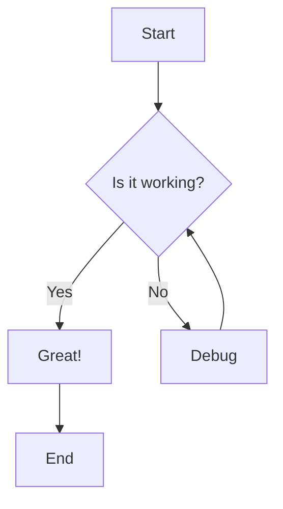
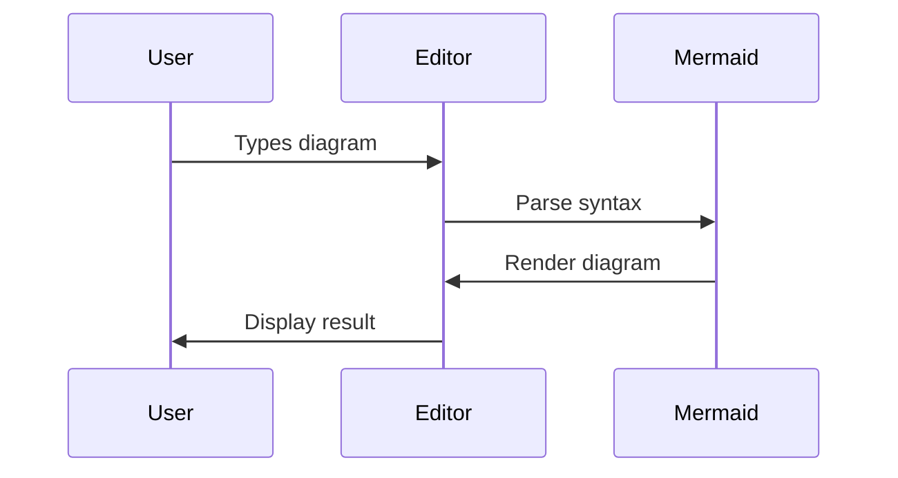
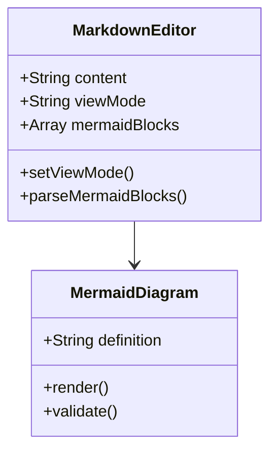
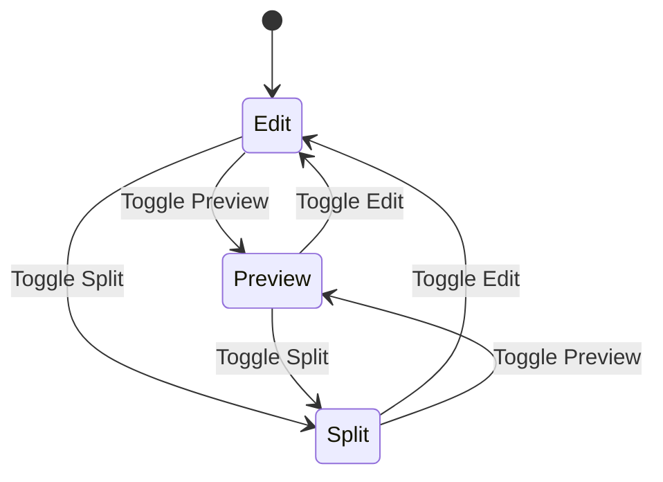
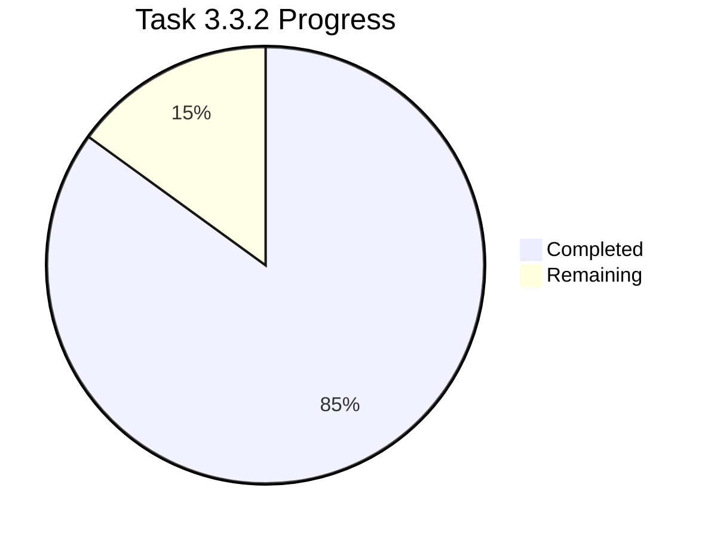

# Mermaid Diagram Test Document

This document contains various Mermaid diagrams to test the integration in Project Yarn's Markdown editor.

## Flowchart Example



## Sequence Diagram



## Class Diagram



## Git Graph

```mermaid
gitgraph
    commit id: "Initial"
    branch feature
    checkout feature
    commit id: "Add Mermaid"
    commit id: "Test diagrams"
    checkout main
    merge feature
    commit id: "Release"
```

## State Diagram



## Regular Markdown Content

This is regular markdown content that should render normally:

- **Bold text**
- *Italic text*
- `Code snippets`
- [Links](https://example.com)

### Code Block (Non-Mermaid)

```javascript
function testMermaid() {
    console.log("This should not be rendered as a diagram");
    return "Just regular code";
}
```

## Another Mermaid Diagram



This document tests various Mermaid diagram types and ensures they render correctly in the sandboxed iframe while preserving regular markdown functionality.
